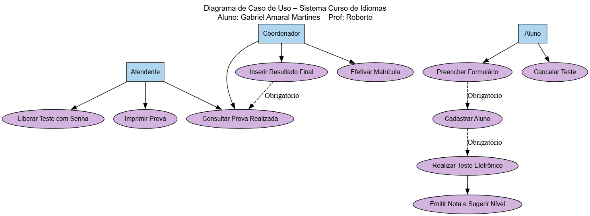

# Sistema de Avaliação de Nível – Curso de Idiomas

Este projeto contém o **Diagrama de Caso de Uso** do sistema de avaliação de nível de alunos para um curso de idiomas.

---

## 📂 Arquivos nesta pasta:

- **sistema_curso_idiomas.dot** → Código fonte do diagrama (Graphviz DOT)
- **idiomas.png** → Imagem gerada do diagrama (visualização abaixo)

---

## 📝 Descrição geral do sistema:

O sistema permite que a escola de idiomas faça a avaliação do nível linguístico de alunos por meio de uma prova eletrônica, com as seguintes funcionalidades principais:

- Cadastro de aluno (Nome, Endereço, Telefone)
- Liberação de acesso ao teste (com senha)
- Realização do teste eletrônico (com possibilidade de cancelar a qualquer momento)
- Emissão automática de nota e sugestão de nível
- Consulta da prova pela atendente
- Impressão da prova para o coordenador
- Inserção do resultado final pelo coordenador após teste oral
- Condução do aluno para efetivação da matrícula

---

## 🖼️ Visualização do diagrama:

---

## ✅ Autor:

Gabriel Amaral Martines
