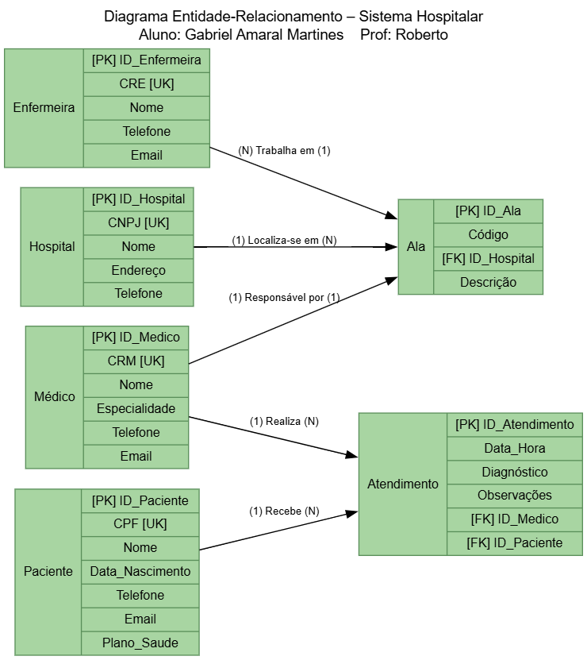

# Sistema Hospitalar – Diagrama ER (Entidade-Relacionamento)

Este projeto contém o diagrama do Sistema Hospitalar, feito em Graphviz.

---

## 📂 Arquivos nesta pasta:

- **sistema_hospitalar.dot** → Código fonte do diagrama (Graphviz DOT)
- **hospital.png** → Imagem gerada do diagrama (visualização abaixo)

---

## 🖼️ Visualização do diagrama:

Abaixo está a visualização do diagrama diretamente em PNG:

---

## ✅ Sobre o sistema:

O Sistema Hospitalar gerencia informações sobre:

- Hospital
- Ala
- Médico
- Enfermeira
- Paciente
- Atendimento

Incluindo os relacionamentos entre essas entidades.

---

Autor: Gabriel Amaral Martines
